Eldrow (Wordle in reverse) is an interactive, universal Wordle solver that attempts to achieve near to mathematically perfect performance without relying on precomputations, inspired by [this great video](https://www.youtube.com/watch?v=v68zYyaEmEA) by [Grant Sanderson](https://github.com/3b1b/).

Eldrow can be dynamically expanded to work with any language's Wordle by just adding a subfolder in `data/` with the lists of valid guesses and answers for that specific Wordle. These lists must contain one 5-character word per line, and can usually be found in the JS code of the Wordle in question.

To run Eldrow, use: `eldrow [--language=xx] [--benchmark]`, note that the `data/` folder must be in the current working directory.

Both parameters are optional. If no language code is specified, English is used by default. The `--benchmark` flag runs a benchmark on the selected language, displaying the average number of tries it takes to solve every word and the tries distribution.

No precomputations are needed, everything is calculated on-the-fly.

Right now, the following languages are included (PRs with more languages are welcome!):

- [English (Wordle)](https://www.nytimes.com/games/wordle/index.html)
- [Spanish (Wordle)](https://wordle.danielfrg.com/)
- [Italian (Parole)](https://pietroppeter.github.io/wordle-it/)
- [Latvian (Vārdulis)](https://wordle.lielakeda.lv/)
- [Ukrainian (Словко)](https://slovko.zaxid.net/)
